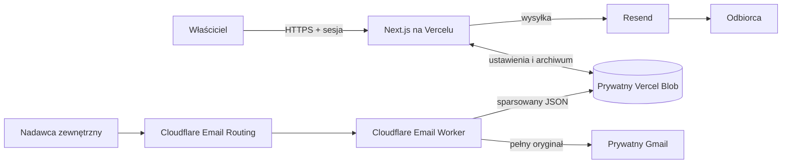

# CC Consulting Webmail

Prywatny, jednoosobowy panel pocztowy dla `ccconsulting.pl`. Aplikacja pozwala pisać i wysyłać wiadomości przez Resend, zarządzać nadawcami, podpisem i szablonami HTML, przeglądać archiwum wysłanych wiadomości oraz obsługiwać korespondencję przychodzącą zapisywaną przez Cloudflare Email Worker.

Docelowy adres aplikacji: `https://webmail.ccconsulting.pl`.

## Spis treści

- [Najważniejsze funkcje](#najważniejsze-funkcje)
- [Architektura](#architektura)
- [Stack](#stack)
- [Struktura projektu](#struktura-projektu)
- [Uruchomienie lokalne](#uruchomienie-lokalne)
- [Zmienne środowiskowe](#zmienne-środowiskowe)
- [Logowanie i sesja](#logowanie-i-sesja)
- [Wysyłanie wiadomości](#wysyłanie-wiadomości)
- [Nadawcy, podpis i szablony](#nadawcy-podpis-i-szablony)
- [Wiadomości przychodzące](#wiadomości-przychodzące)
- [Wątki i odpowiedzi](#wątki-i-odpowiedzi)
- [Model danych w Vercel Blob](#model-danych-w-vercel-blob)
- [Endpointy aplikacji](#endpointy-aplikacji)
- [Wdrożenie](#wdrożenie)
- [Bezpieczeństwo](#bezpieczeństwo)
- [Testy i weryfikacja](#testy-i-weryfikacja)
- [Ograniczenia](#ograniczenia)
- [Rozwiązywanie problemów](#rozwiązywanie-problemów)

## Najważniejsze funkcje

- logowanie wyłącznie prywatnym kluczem zapisanym w `WEBMAIL_SECRET`;
- siedmiodniowa sesja w podpisanym ciasteczku `HttpOnly`;
- ciemny, responsywny interfejs przeznaczony dla jednego użytkownika;
- komponowanie wiadomości w ograniczonym edytorze Tiptap;
- wybór nadawcy z listy i wskazanie nadawcy domyślnego;
- pola `Do`, `DW`, temat i edytowalna etykieta wiadomości;
- wysyłka przez Resend, osobno do każdego głównego odbiorcy;
- globalny podpis automatycznie dodawany do wiadomości;
- wbudowany wygląd wiadomości oraz własne szablony HTML;
- podgląd wiadomości przed wysłaniem;
- archiwum wysłanych wiadomości w prywatnym Vercel Blob;
- ręczna archiwizacja i przywracanie wysłanych wiadomości oraz odebranych rozmów;
- odbiór poczty przez Cloudflare Email Routing i osobnego Email Workera;
- kopia każdej wiadomości przychodzącej przekazywana do prywatnego Gmaila;
- widok rozmów, wyszukiwanie oraz statusy „do odpowiedzi” i „odpowiedziano”;
- odpowiedzi z poprawnymi nagłówkami `In-Reply-To` i `References` oraz historią rozmowy.

Nie ma automatycznego UDW/BCC. Pole załączników wychodzących jest obecnie wyłączone w interfejsie.

## Architektura

Projekt składa się z dwóch niezależnie wdrażanych części:

1. aplikacji Next.js uruchamianej na Vercelu;
2. Cloudflare Email Workera odbierającego pocztę domeny.



### Outbound

```text
przeglądarka
  → chroniony endpoint Next.js
  → Resend Batch API
  → odbiorca

po udanej wysyłce
  → sent/messages/<uuid>.json
  → sent/index.json
```

### Inbound

```text
zewnętrzny nadawca
  → office@ccconsulting.pl / biuro@ccconsulting.pl
  → Cloudflare Email Routing
  → Cloudflare Email Worker
      ├─ forward pełnej wiadomości → Gmail
      └─ parsowanie MIME → emails/inbound/<sha256>.json
                              ↓
                       webmail na Vercelu
```

Worker obsługuje wyłącznie pocztę przychodzącą. Standardowa wysyłka i odpowiedzi wychodzą z aplikacji Next.js przez Resend. W projekcie nie są używane Firebase, Firestore ani Firebase Auth.

## Stack

| Warstwa | Technologia |
| --- | --- |
| Frontend i backend | Next.js 16, App Router, React 19, TypeScript |
| Edytor wiadomości | Tiptap 3 |
| Wysyłka | Resend Node.js SDK |
| Dane aplikacji | prywatny Vercel Blob |
| Routing poczty przychodzącej | Cloudflare Email Routing |
| Przetwarzanie inbound | Cloudflare Email Worker |
| Parser MIME | `postal-mime` |
| Ikony | Lucide React |
| Sanityzacja HTML | `sanitize-html` |
| Testy jednostkowe | Node.js test runner uruchamiany przez `tsx` |
| Testy E2E | Playwright |

## Struktura projektu

```text
.
├─ src/
│  ├─ app/
│  │  ├─ api/                    # chronione endpointy serwerowe
│  │  └─ dashboard/              # widoki aplikacji po zalogowaniu
│  ├─ components/                # kompozytor, edytory i elementy interfejsu
│  ├─ emails/offer-email.tsx     # wbudowany wygląd wiadomości
│  └─ lib/                       # sesje, Blob, threading i sanityzacja
├─ public/templates/
│  └─ cc-consulting.html         # eksport wbudowanego szablonu
├─ templates/
│  └─ cold-mail-georgia.html     # prosty szablon do ręcznego importu
├─ scripts/export-template.ts    # regenerowanie eksportu szablonu
├─ tests/                        # testy jednostkowe i E2E
└─ workers/ccconsulting-inbound/
   ├─ src/index.js               # Cloudflare Email Worker
   ├─ wrangler.jsonc             # konfiguracja Workera
   └─ package.json               # osobne zależności i skrypty Workera
```

### Widoki aplikacji

| Ścieżka | Przeznaczenie |
| --- | --- |
| `/` | formularz logowania kluczem |
| `/dashboard` | ekran startowy i skróty |
| `/dashboard/wysylki` | nowa wiadomość lub odpowiedź |
| `/dashboard/wyslane` | lista wysłanych wiadomości |
| `/dashboard/wyslane/[id]` | szczegóły zarchiwizowanej wiadomości |
| `/dashboard/odebrane` | lista rozmów przychodzących |
| `/dashboard/odebrane/[id]` | historia rozmowy i przejście do odpowiedzi |
| `/dashboard/nadawcy` | lista nadawców i wybór domyślnego |
| `/dashboard/szablony` | zarządzanie szablonami HTML |

## Uruchomienie lokalne

### Wymagania

- Node.js `>= 20.9`;
- npm;
- konto i klucz API Resend do prawdziwej wysyłki;
- prywatny Vercel Blob połączony z projektem;
- opcjonalnie Wrangler i konto Cloudflare do pracy nad inbound Workerem.

### Aplikacja Next.js

```powershell
npm install
Copy-Item .env.example .env.local
node -e "console.log(require('node:crypto').randomBytes(32).toString('hex'))"
```

Wklej wygenerowany klucz do `WEBMAIL_SECRET` w `.env.local`, uzupełnij pozostałe zmienne i uruchom:

```powershell
npm run dev
```

Aplikacja będzie dostępna pod `http://localhost:3000`.

Zmienne połączonego projektu Vercel można pobrać lokalnie poleceniem:

```powershell
vercel env pull .env.local
```

Sprawdź po pobraniu, czy własne `WEBMAIL_SECRET` i `RESEND_API_KEY` nadal mają właściwe wartości. Pliki `.env*` z sekretami nie powinny trafiać do repozytorium.

### Cloudflare Email Worker

Worker jest osobnym projektem npm:

```powershell
Set-Location workers/ccconsulting-inbound
npm install
npm run dev
```

`wrangler dev` uruchamia środowisko deweloperskie Workera. Lokalny zapis do Blob wymaga przekazania `BLOB_READ_WRITE_TOKEN` zgodnie z mechanizmem lokalnych sekretów Wranglera; nie umieszczaj wartości w śledzonym pliku ani w `wrangler.jsonc`. Polecenie `wrangler secret put` opisane w sekcji wdrożenia ustawia sekret zdalnego Workera. Rzeczywiste dostarczanie poczty wymaga skonfigurowania Email Routing w panelu Cloudflare.

## Zmienne środowiskowe

### Next.js / Vercel

| Zmienna | Wymagana | Znaczenie |
| --- | --- | --- |
| `WEBMAIL_SECRET` | tak | prywatny klucz logowania i sekret podpisujący sesje |
| `RESEND_API_KEY` | do wysyłki | klucz API Resend |
| `BLOB_STORE_ID` | do Blob z OIDC | identyfikator połączonego Blob store; SDK odczytuje go automatycznie |
| `VERCEL_OIDC_TOKEN` | do Blob z OIDC | token wystawiany przez Vercel; SDK odczytuje go automatycznie |
| `BLOB_READ_WRITE_TOKEN` | alternatywa / lokalnie | statyczne poświadczenie prywatnego Blob, wymagane gdy OIDC nie jest dostępne |
| `BLOB_WEBHOOK_PUBLIC_KEY` | dla client upload | klucz do weryfikacji callbacków uploadu, dostarczany przez połączenie Blob |

Nie używaj prefiksu `NEXT_PUBLIC_` dla żadnego sekretu. `WEBMAIL_SECRET` nie może być pusty ani dłuższy niż 1024 znaki. Zalecana wartość to co najmniej 32 losowe bajty, na przykład 64 znaki hex z generatora podanego wyżej.

Aktualny `@vercel/blob` potrafi uwierzytelnić aplikację parą `VERCEL_OIDC_TOKEN` + `BLOB_STORE_ID`; statyczny `BLOB_READ_WRITE_TOKEN` jest rozwiązaniem alternatywnym i nadal jest używany lokalnie w `.env.example`. Połączenie Blob z projektem Vercel tworzy właściwe zmienne automatycznie. Nie kopiuj krótkotrwałego tokenu OIDC ręcznie między usługami.

### Cloudflare Worker

| Zmienna | Typ | Znaczenie |
| --- | --- | --- |
| `BLOB_READ_WRITE_TOKEN` | sekret Workera | zapis wiadomości bezpośrednio do tego samego prywatnego Vercel Blob |
| `FORWARD_TO` | zwykła zmienna | zweryfikowany adres docelowy kopii wiadomości w Gmailu |

`BLOB_READ_WRITE_TOKEN` trzeba ustawić w katalogu Workera przez `wrangler secret put`; nie należy wpisywać jego wartości do `wrangler.jsonc`. Worker działa poza Vercel i przekazuje ten token jawnie do SDK, dlatego nie korzysta z Vercel OIDC. Kod ma awaryjny adres `root.woozie@gmail.com`, ale konfiguracja `FORWARD_TO` pozostaje właściwym źródłem ustawienia środowiskowego.

## Logowanie i sesja

Aplikacja nie ma kont użytkowników ani nazwy użytkownika. Formularz porównuje podany klucz z `WEBMAIL_SECRET` po stronie serwera. Porównanie odbywa się w stałym czasie na skrótach SHA-256.

Po poprawnym logowaniu serwer tworzy token zawierający czas wygaśnięcia i losowy nonce. Token jest podpisany HMAC-SHA256 kluczem `WEBMAIL_SECRET` i zapisany w ciasteczku:

- `webmail-session` lokalnie;
- `__Host-webmail-session` na produkcji;
- `HttpOnly`;
- `SameSite=Strict`;
- `Secure` na produkcji;
- ścieżka `/`;
- ważność 7 dni.

Ciasteczko nie zawiera klucza logowania. Aplikacja nie zapisuje secretu w `localStorage`. Zmiana `WEBMAIL_SECRET` natychmiast unieważnia istniejące sesje. Wylogowanie usuwa bieżące ciasteczko.

Layout dashboardu sprawdza sesję po stronie serwera. Endpointy modyfikujące dane dodatkowo wymagają poprawnej sesji i zgodności nagłówka `Origin` z hostem żądania.

## Wysyłanie wiadomości

Kompozytor pozwala wybrać:

- nadawcę;
- szablon;
- maksymalnie 20 głównych adresów odbiorców;
- maksymalnie 20 adresów DW;
- temat do 200 znaków;
- etykietę szablonu do 60 znaków;
- treść i globalny podpis.

Adresy można rozdzielać przecinkiem, średnikiem lub nową linią. Duplikaty są usuwane. Dla każdego adresu w polu `Do` powstaje osobna wiadomość w wywołaniu `resend.batch.send()`, dlatego główni odbiorcy nie widzą siebie nawzajem. Lista DW jest dołączana do każdej z tych wiadomości.

Edytor Tiptap udostępnia tylko funkcje potrzebne w korespondencji: akapity, nagłówki, pogrubienie, kursywę, podkreślenie, przekreślenie, listy, wyrównanie, linki i historię zmian. HTML treści jest sanityzowany na serwerze.

Po poprawnej odpowiedzi Resend aplikacja zapisuje pełny rekord w Blob. Jeżeli zapis archiwum się nie powiedzie, użytkownik otrzymuje ostrzeżenie, ale już wysłana wiadomość nie jest cofana.

### Załączniki wychodzące

Pole załączników jest obecnie wyłączone w kompozytorze. Backend ma przygotowany przepływ prywatnego uploadu i wysyłki dla maksymalnie 10 plików o łącznym rozmiarze do 20 MB, ale interfejs celowo go jeszcze nie udostępnia. Nie należy dokumentować załączników wychodzących jako gotowej funkcji użytkowej.

## Nadawcy, podpis i szablony

### Nadawcy

Lista nadawców znajduje się w `settings/senders.json`. Można dodać, edytować i usunąć nadawcę oraz wskazać jeden rekord domyślny.

- maksymalnie 20 nadawców;
- nazwa do 100 znaków;
- adresy muszą być unikalne;
- na liście zawsze pozostaje co najmniej jeden nadawca;
- usunięcie domyślnego ustawia jako domyślny pierwszy pozostały rekord.

Jeżeli Blob nie zawiera ustawienia lub dane są niepoprawne, aplikacja używa wartości początkowej:

```text
Cezary Czerwiński <biuro@ccconsulting.pl>
```

Każdy używany adres lub jego domena musi być dopuszczony do wysyłki w Resend. Wybór w polu `Od` aktualizuje także oznaczenie nadawcy i podgląd w kompozytorze.

### Podpis

Jeden globalny podpis jest zapisany jako HTML w `settings/email-signature.html`. Jest sanityzowany przy zapisie i automatycznie dokładany do każdej wiadomości. Podpis nie jest obecnie przypisany osobno do nadawcy.

### Szablony

Własne szablony są przechowywane w `settings/templates.json`. Można zapisać maksymalnie 20 szablonów, każdy o nazwie do 100 znaków i kodzie HTML do 100 000 znaków.

Dostępne zmienne:

| Zmienna | Wartość |
| --- | --- |
| `{{body}}` | HTML treści wiadomości; wymagane |
| `{{signature}}` | HTML podpisu |
| `{{subject}}` | temat po escapowaniu |
| `{{label}}` | etykieta po escapowaniu |

Zmienne działają wyłącznie w pozycjach tekstowych, nie w atrybutach HTML. Kod jest sanityzowany, a skrypty, formularze i niedozwolone schematy URL są usuwane.

Jeżeli nie wybrano własnego szablonu, aplikacja używa wbudowanego komponentu `src/emails/offer-email.tsx`. Jego statyczny eksport znajduje się w `public/templates/cc-consulting.html` i można go odtworzyć poleceniem:

```powershell
npx tsx scripts/export-template.ts
```

Plik `templates/cold-mail-georgia.html` to prosty, kompatybilny szablon cold maila do ręcznego skopiowania do widoku „Szablony”.

## Wiadomości przychodzące

### Cloudflare Email Inbound Worker

Kod Workera znajduje się w:

```text
workers/ccconsulting-inbound/
```

Jego aktualna konfiguracja:

- nazwa: `ccconsulting-inbound`;
- entrypoint: `src/index.js`;
- `workers_dev: false`;
- `preview_urls: false`;
- data kompatybilności: `2025-05-23`;
- `observability.enabled` ma wartość `false`; sekcja logów ma `enabled: true`, `persist: true` i `invocation_logs: true`, a traces są wyłączone;
- parser: `postal-mime`;
- zapis: `@vercel/blob` bez pośredniego endpointu Next.js.

Adresy, między innymi `office@ccconsulting.pl` i `biuro@ccconsulting.pl`, należy skierować regułami Cloudflare Email Routing do tego Workera. Same reguły routingowe są konfigurowane w panelu Cloudflare i nie znajdują się w `wrangler.jsonc`.

### Przebieg obsługi

Po odebraniu wiadomości Worker:

1. ustala adres kopii z `FORWARD_TO`;
2. próbuje sparsować MIME przez `postal-mime`;
3. tworzy stabilny identyfikator SHA-256;
4. równolegle przekazuje pełny oryginał do Gmaila i zapisuje JSON do Blob;
5. raportuje wynik obu operacji w logach.

Forward i zapis do Blob są niezależne. Awaria Blob zostaje zalogowana i nie blokuje dostarczenia kopii do Gmaila. Awaria forwardowania jest krytyczna i powoduje błąd wykonania Workera, co pozwala platformie potraktować obsługę jako nieudaną. Błąd parsera także nie blokuje forwardowania; Worker zapisuje wtedy dostępne dane podstawowe i informację `parse.success: false`.

Worker nie loguje pełnej treści wiadomości. Logi zawierają wynik operacji, identyfikator, docelowy pathname lub adres forwardowania oraz komunikaty błędów.

### Limity parsera

- wiadomości większe niż 20 MB nie są parsowane;
- maksymalny rozmiar nagłówków parsera wynosi 1 MB;
- maksymalna głębokość zagnieżdżenia MIME wynosi 64;
- zapis do Blob ma timeout 10 sekund.

Nawet gdy wiadomość przekracza limit parsowania, Worker nadal próbuje przekazać jej pełny oryginał do Gmaila.

### Idempotencja

Identyfikator rekordu jest skrótem SHA-256 złożonym z:

```text
Message-ID
envelope from
envelope to
Date
Subject
rawSize
```

Wynik trafia pod `emails/inbound/<sha256>.json` z `allowOverwrite: true`. Ponowienie obsługi tej samej wiadomości zapisuje ten sam logiczny rekord zamiast generować kolejne UUID.

### Załączniki przychodzące

Worker zapisuje wyłącznie metadane załączników: nazwę, typ MIME, disposition, Content-ID, flagę `related` i rozmiar. Binarny content nie trafia do Blob. Pełna wiadomość wraz z plikami pozostaje w Gmailu, a interfejs webmaila wyświetla stosowną informację.

## Wątki i odpowiedzi

Aplikacja skanuje rekordy `emails/inbound/*.json` oraz `sent/messages/*.json` i buduje rozmowy na podstawie rzeczywistych nagłówków pocztowych:

- `Message-ID`;
- `In-Reply-To`;
- `References`;
- bezpośredniego powiązania `replyToKey` zapisanego przez aplikację.

Temat nie służy do łączenia wiadomości, ponieważ ten sam temat może występować w niezależnych rozmowach. Samodzielne wiadomości wychodzące bez powiązania z inbound nie pojawiają się na liście odebranych rozmów; są dostępne w „Wysłane”.

Rozmowa ma status „odpowiedziano”, gdy istnieje wychodząca odpowiedź powiązana z jej najnowszą wiadomością przychodzącą. Nowa wiadomość od rozmówcy ponownie ustawia ją jako wymagającą odpowiedzi. Odpowiedzi wysłane wyłącznie z Gmaila nie są widoczne w archiwum aplikacji, więc nie zmienią statusu w webmailu.

Widok odebranych obsługuje:

- wyszukiwanie po nadawcy i temacie;
- filtrowanie wszystkich, oczekujących i obsłużonych rozmów;
- paginację po 25 rozmów;
- chronologiczną oś wiadomości przychodzących i odpowiedzi;
- informację o rekordach, których nie udało się odczytać.

Podczas odpowiedzi aplikacja:

1. wybiera adres `Reply-To`, a gdy go nie ma — `From`;
2. dobiera nadawcę pasującego do adresu, na który przyszła wiadomość;
3. przy braku dopasowania używa nadawcy domyślnego i pokazuje ostrzeżenie;
4. normalizuje temat do pojedynczego prefiksu `Re:`;
5. ustawia `In-Reply-To` na `Message-ID` wiadomości źródłowej;
6. rozszerza i deduplikuje `References`, ograniczając długość nagłówka do około 800 znaków;
7. dokłada poniżej odpowiedzi bezpieczną kopię wiadomości źródłowej wraz z historią, która była już w niej zawarta.

Mechanizm nie dopisuje automatycznie innych rekordów z osi rozmowy. Dzięki temu odpowiedź nie cytuje wiadomości, które przyszły później niż wybrany mail ani równoległych gałęzi konwersacji.

HTML wiadomości przychodzących jest sanityzowany i renderowany w sandboxowanym `iframe`. Polityka CSP blokuje skrypty, formularze i zewnętrzne obrazy.

## Model danych w Vercel Blob

Blob store musi być prywatny. Aplikacja i Worker używają tego samego magazynu.

| Pathname | Zawartość |
| --- | --- |
| `settings/senders.json` | lista nadawców i informacja o domyślnym |
| `settings/email-signature.html` | globalny podpis |
| `settings/templates.json` | własne szablony HTML |
| `settings/archive-state.json` | stan archiwizacji wysyłek i rozmów |
| `sent/index.json` | skrócony indeks ostatnich 1000 wysyłek |
| `sent/messages/<uuid>.json` | pełny rekord wysłanej wiadomości |
| `sent/attachments/<messageId>/<filename>` | zarchiwizowane załączniki wychodzące, gdy funkcja zostanie udostępniona |
| `attachments/*` | tymczasowe uploady załączników wychodzących |
| `emails/inbound/<sha256>.json` | wiadomości przychodzące zapisane przez Workera |

### Rekord inbound

Aktualny Worker zapisuje strukturę w wersji `schemaVersion: 1`:

```json
{
  "schemaVersion": 1,
  "id": "sha256",
  "direction": "inbound",
  "receivedAt": "2026-09-22T12:00:00.000Z",
  "envelope": {
    "from": "sender@example.com",
    "to": "office@ccconsulting.pl"
  },
  "from": { "name": "Sender", "address": "sender@example.com" },
  "sender": null,
  "to": [],
  "cc": [],
  "bcc": [],
  "replyTo": [],
  "subject": "Temat",
  "date": "...",
  "messageId": "<id@example.com>",
  "inReplyTo": null,
  "references": null,
  "deliveredTo": null,
  "returnPath": null,
  "text": "...",
  "html": "...",
  "headers": [],
  "rawSize": 1234,
  "parse": {
    "success": true,
    "error": null
  },
  "attachments": [
    {
      "filename": "document.pdf",
      "mimeType": "application/pdf",
      "disposition": "attachment",
      "contentId": null,
      "related": false,
      "size": 123456
    }
  ]
}
```

Wartości nagłówków mogą być `null`, a kształt pól adresowych pochodzi z `postal-mime`. Konsument powinien nadal walidować dane, co robi `src/lib/inbound-mail.ts`.

### Rekord outbound

Pełny rekord `sent/messages/<uuid>.json` zawiera:

```ts
type SentMessage = {
  id: string;
  sentAt: string;
  from: string;
  to: string[];
  cc: string[];
  subject: string;
  templateLabel?: string;
  templateName?: string;
  renderedHtml?: string;
  bodyHtml: string;
  signatureHtml: string;
  resendIds: string[];
  replyToKey?: string;
  replyHistoryHtml?: string;
  inReplyTo?: string;
  references?: string;
  emailMessageIds?: string[];
  attachments: Array<{
    filename: string;
    pathname: string;
    size: number;
    contentType: string;
  }>;
};
```

Dla własnego szablonu przechowywany jest także wynikowy `renderedHtml`, dzięki czemu późniejsza edycja tego szablonu nie zmienia historycznego podglądu. Wiadomości wysłane przez wbudowany szablon są rekonstruowane z zapisanej treści i bieżącej wersji komponentu.

### Ujednolicony model rozmowy

Inbound i outbound pozostają osobnymi, wersjonowanymi rekordami. Warstwa `conversation-store.ts` tworzy wspólny model odczytowy:

```ts
type Conversation = {
  id: string;
  incoming: InboundMail[];
  outgoing: SentMessage[];
  latest: InboundMail;
  updatedAt: string;
  answered: boolean;
};
```

To celowe rozwiązanie: Worker nie musi znać modelu archiwum wysyłek, a Next.js łączy oba kierunki przez standardowe identyfikatory wiadomości. Odczyt pojedynczych blobów rozmów jest cache'owany do godziny z datą uploadu jako częścią klucza; lista obiektów jest pobierana ponownie przy budowaniu widoku.

### Archiwizacja

Archiwizacja nie przenosi ani nie usuwa rekordów wiadomości. Plik `settings/archive-state.json` przechowuje identyfikatory zarchiwizowanych wysyłek oraz migawkę daty najnowszego maila przychodzącego w zarchiwizowanej rozmowie. Widoki „Wysłane” i „Odebrane” dzielą dane na osobne listy bieżące i archiwalne; każdą pozycję można później przywrócić.

Jeżeli do zarchiwizowanego wątku przyjdzie nowa wiadomość, jej data będzie późniejsza od zapisanej migawki i rozmowa automatycznie wróci na listę bieżącą. Sama odpowiedź wychodząca nie powoduje takiego przywrócenia.

## Endpointy aplikacji

Wszystkie endpointy modyfikujące wymagają sesji oraz żądania z tego samego originu.

| Endpoint | Metoda | Działanie |
| --- | --- | --- |
| `/api/send` | `POST` | walidacja, renderowanie, wysyłka przez Resend i archiwizacja |
| `/api/archive` | `POST` | archiwizacja lub przywrócenie wysyłki albo rozmowy |
| `/api/signature` | `POST` | zapis globalnego podpisu |
| `/api/senders` | `POST` | dodanie nadawcy |
| `/api/senders` | `PUT` | edycja nadawcy |
| `/api/senders` | `PATCH` | ustawienie nadawcy domyślnego |
| `/api/senders` | `DELETE` | usunięcie nadawcy |
| `/api/templates` | `POST` | dodanie szablonu |
| `/api/templates` | `PUT` | edycja szablonu |
| `/api/templates` | `DELETE` | usunięcie szablonu |
| `/api/templates/preview` | `POST` | bezpieczne wyrenderowanie podglądu |
| `/api/blob/upload` | `POST` | token/obsługa tymczasowego uploadu załącznika |
| `/api/blob/upload` | `DELETE` | usunięcie tymczasowych plików |
| `/api/sent/[id]/attachment` | `GET` | autoryzowane strumieniowanie pliku przypisanego do wiadomości |

Endpoint pobierania załącznika sprawdza, czy żądany pathname rzeczywiście należy do wskazanego rekordu wiadomości. Odpowiedź ma `Cache-Control: private, no-store` i `X-Content-Type-Options: nosniff`.

## Wdrożenie

### 1. Resend

1. Dodaj i zweryfikuj domenę `ccconsulting.pl` w Resend.
2. Skonfiguruj rekordy DNS wskazane przez Resend.
3. Utwórz klucz API z uprawnieniem do wysyłki.
4. Dodaj go w Vercel jako `RESEND_API_KEY`.
5. Upewnij się, że każdy adres dostępny w „Nadawcy” może wysyłać z tej domeny.

Aplikacja korzysta z Batch API i niestandardowych nagłówków dla threadingu odpowiedzi.

### 2. Prywatny Vercel Blob

1. Utwórz lub podłącz prywatny Blob store do projektu Vercel.
2. Udostępnij poświadczenia we wszystkich środowiskach, w których aplikacja ma działać. Na Vercelu preferowane jest OIDC tworzone przez połączenie projektu ze store.
3. Do lokalnego developmentu pobierz je przez `vercel env pull`.
4. Skopiuj token read-write także do sekretów Cloudflare Workera.

Aplikacja zakłada prywatny magazyn i wykonuje odczyty po stronie serwera. Publiczny store ujawniłby treść wiadomości przez bezpośrednie URL-e i nie jest właściwą konfiguracją dla tego projektu.

### 3. Next.js na Vercelu

1. Zaimportuj repozytorium jako projekt Next.js.
2. Dodaj `WEBMAIL_SECRET` i `RESEND_API_KEY`.
3. Połącz prywatny Blob store.
4. Wdróż aplikację.
5. Dodaj domenę `webmail.ccconsulting.pl` w ustawieniach projektu.
6. Ustaw rekord DNS dokładnie według wartości pokazanej przez Vercel.
7. Po zmianie sekretów wykonaj nowe wdrożenie, jeśli Vercel tego wymaga dla danego środowiska.

Dla środowisk Preview używaj osobnego klucza logowania i, jeśli to możliwe, oddzielnych zasobów lub świadomie ograniczonych poświadczeń.

### 4. Cloudflare Email Worker

```powershell
Set-Location workers/ccconsulting-inbound
npm install
npx wrangler login
npx wrangler secret put BLOB_READ_WRITE_TOKEN
npm run deploy
```

Następnie w Cloudflare:

1. włącz Email Routing dla `ccconsulting.pl`;
2. zweryfikuj adres docelowy wskazany przez `FORWARD_TO`;
3. utwórz reguły dla `office@ccconsulting.pl` i `biuro@ccconsulting.pl`;
4. jako akcję wybierz Worker `ccconsulting-inbound`;
5. wyślij testową wiadomość z zewnętrznego adresu;
6. sprawdź jednocześnie Gmail, logi Workera, `emails/inbound/` w Blob i widok „Odebrane”.

Zmiana nazwy Workera może zerwać powiązanie z regułami Email Routing, dlatego po takiej zmianie trzeba sprawdzić konfigurację routingu.

## Bezpieczeństwo

Zaimplementowane zabezpieczenia:

- secret i klucze usług pozostają wyłącznie po stronie serwera;
- sesja jest podpisana HMAC i trzymana w ciasteczku `HttpOnly`;
- produkcyjne ciasteczko używa `Secure` i prefiksu `__Host-`;
- operacje modyfikujące sprawdzają sesję oraz same-origin;
- dashboard jest chroniony po stronie serwera;
- Vercel Blob jest prywatny;
- treść, podpisy i szablony są sanityzowane;
- podgląd inbound działa w sandboxowanym `iframe` z restrykcyjnym CSP;
- wszystkie odpowiedzi aplikacji otrzymują `X-Content-Type-Options: nosniff`, `X-Frame-Options: DENY`, `Referrer-Policy: same-origin` i ograniczony `Permissions-Policy`;
- Worker nie loguje treści wiadomości ani sekretów;
- pełny oryginał inbound jest zachowywany niezależnie w Gmailu.

Pozostałe zalecenia operacyjne:

- używaj długiego, losowego `WEBMAIL_SECRET`;
- rotuj klucze po podejrzeniu wycieku;
- ogranicz zakres klucza Resend;
- nigdy nie commituj `.env.local`, plików `.dev.vars` ani sekretów Workera;
- kontroluj zużycie i logi Vercel, Resend oraz Cloudflare;
- skonfiguruj rate limiting dla formularza logowania w Vercel Firewall albo dodaj współdzielony limiter w aplikacji.

Aplikacja nie ma obecnie własnego limitera prób logowania. Model jednego wspólnego secretu nie zapewnia osobnych kont, audytu użytkowników ani możliwości wylogowania pojedynczego urządzenia po stronie serwera.

## Testy i weryfikacja

### Skrypty głównej aplikacji

```powershell
npm run lint
npm run typecheck
npm test
npm run build
npx playwright test
```

| Skrypt | Zakres |
| --- | --- |
| `npm run lint` | ESLint dla repozytorium |
| `npm run typecheck` | TypeScript bez emisji plików |
| `npm test` | testy logiki sesji, szablonów, treści, inbound, odpowiedzi i rozmów |
| `npm run build` | produkcyjny build Next.js |
| `npx playwright test` | przepływy logowania, inbound i szablonów w przeglądarce |

Playwright automatycznie uruchamia aplikację pod `http://localhost:3000`. Testy E2E wymagają poprawnego `WEBMAIL_SECRET`; scenariusze czytające Blob potrzebują także skonfigurowanego magazynu i odpowiednich danych testowych.

### Ręczna próba end-to-end

1. Zaloguj się kluczem.
2. Dodaj testowego nadawcę lub sprawdź nadawcę domyślnego.
3. Wyślij wiadomość na zewnętrzny adres i sprawdź Resend oraz „Wysłane”.
4. Odpowiedz z zewnętrznej skrzynki na adres `ccconsulting.pl`.
5. Potwierdź kopię w Gmailu i rekord `emails/inbound/*.json`.
6. Otwórz rozmowę w „Odebrane”, wyślij odpowiedź i sprawdź status oraz historię w obu klientach pocztowych.

## Ograniczenia

- aplikacja jest przeznaczona dla jednej osoby i jednego wspólnego klucza;
- brak odzyskiwania klucza oraz panelu zarządzania sesjami;
- brak aplikacyjnego rate limitera logowania;
- załączniki wychodzące są wyłączone w interfejsie;
- inbound przechowuje tylko metadane załączników, a pliki pozostają w Gmailu;
- odpowiedzi wysłane poza aplikacją nie trafiają do jej archiwum i nie aktualizują statusu rozmowy;
- lista „Wysłane” opiera się na indeksie ograniczonym do 1000 ostatnich wpisów;
- pliki ustawień i indeks wysłanych są aktualizowane metodą odczyt–modyfikacja–zapis bez blokady, więc równoczesne mutacje mogą nadpisać ostatnią zmianę;
- wczytanie bardzo dużej liczby wiadomości wymaga listowania i składania danych po stronie serwera;
- odczyty treści używane do budowania rozmów mogą pozostawać w cache do godziny;
- Worker nie ma obecnie osobnego zestawu testów automatycznych;
- aplikacja nie śledzi dostarczeń, odbić, otwarć ani kliknięć przez webhooki Resend.

## Rozwiązywanie problemów

### Nie można się zalogować

- sprawdź, czy `WEBMAIL_SECRET` istnieje w aktualnym środowisku Vercel;
- po zmianie secretu zaloguj się ponownie, ponieważ wcześniejsze tokeny stają się nieważne;
- upewnij się, że secret nie ma przypadkowych spacji i nie przekracza 1024 znaków.

### Resend odrzuca wysyłkę

- sprawdź `RESEND_API_KEY`;
- potwierdź weryfikację domeny i DNS;
- sprawdź, czy wybrany adres nadawcy należy do dozwolonej domeny;
- odczytaj konkretny komunikat błędu zwracany przez Resend i log funkcji Vercel.

### Wiadomość została wysłana, ale nie ma jej w „Wysłane”

Oznacza to zwykle, że Resend przyjął wiadomość, a późniejszy zapis do Blob nie powiódł się. Sprawdź połączenie projektu z Blob, poświadczenia i logi funkcji. Nie wysyłaj automatycznie wiadomości ponownie bez sprawdzenia jej w Resend.

### Wiadomość przychodząca jest w Gmailu, ale nie w webmailu

- sprawdź log `Blob storage failed` w Cloudflare;
- sprawdź sekret `BLOB_READ_WRITE_TOKEN` Workera;
- potwierdź, że Worker i aplikacja wskazują ten sam prywatny Blob store;
- sprawdź obecność `emails/inbound/<sha256>.json`.

### Wiadomość jest w Blob, ale nie w rozmowach

- sprawdź `schemaVersion: 1` i `direction: "inbound"`;
- sprawdź poprawność JSON oraz pola `receivedAt` lub `date`;
- zwróć uwagę na licznik pominiętych rekordów w interfejsie;
- uwzględnij cache warstwy rozmów.

### Odpowiedź trafiła do niewłaściwego adresu

Aplikacja preferuje `Reply-To`, a dopiero potem `From`. Sprawdź zapisane nagłówki wiadomości przychodzącej oraz dane sparsowane przez `postal-mime`.

## Dokumentacja usług

- [Next.js: Authentication](https://nextjs.org/docs/app/guides/authentication)
- [Vercel Blob](https://vercel.com/docs/vercel-blob)
- [Vercel Blob: private storage](https://vercel.com/docs/vercel-blob/private-storage)
- [Vercel Blob SDK i uwierzytelnianie](https://vercel.com/docs/vercel-blob/using-blob-sdk)
- [Resend: Send Batch Emails](https://resend.com/docs/api-reference/emails/send-batch-emails)
- [Cloudflare: Route emails](https://developers.cloudflare.com/email-service/get-started/route-emails/)
- [Cloudflare Email Worker handler API](https://developers.cloudflare.com/email-service/api/route-emails/email-handler/)
- [Cloudflare Workers secrets](https://developers.cloudflare.com/workers/configuration/secrets/)
- [postal-mime](https://github.com/postalsys/postal-mime)

## Licencja i przeznaczenie

Repozytorium ma w `package.json` ustawienie `private: true` i jest przeznaczone do prywatnego użytku CC Consulting. Nie zdefiniowano osobnej licencji open source.
